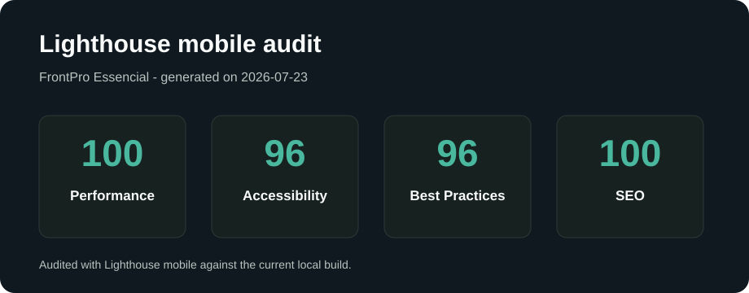

# FrontPro Essencial

Projeto estático de uma jornada de venda para um curso digital de frontend.

O fluxo tem 3 páginas:

- `index.html`: página inicial do produto.
- `upsell.html`: oferta complementar.
- `obrigado.html`: confirmação da compra.

## Tecnologias

- HTML5.
- CSS3.
- JavaScript Vanilla.
- Sem framework JavaScript.
- CSS modular com `@import`.
- JavaScript modular com ES Modules.

## Arquitetura Do Código

O projeto foi organizado para manter a tríade HTML, CSS e JavaScript simples, legível e fácil de evoluir.

O CSS é carregado por `assets/css/styles.css`, que funciona como arquivo de entrada e importa arquivos menores por responsabilidade:

- `tokens.css`: variáveis de cor, espaçamento, fonte, tema claro e tema escuro.
- `base.css`: reset leve, elementos globais, acessibilidade de foco e skip link.
- `layout.css`: containers, seções, header, navegação e estrutura principal.
- `components.css`: botões, toggles, cards, listas, carrossel, CTA e footer.
- `pages.css`: estilos específicos das páginas de upsell e agradecimento.
- `responsive.css`: media queries, ajustes mobile first e preferência por redução de movimento.

O JavaScript é carregado por `assets/js/main.js`, que apenas inicializa os módulos:

- `translations.js`: dicionário de textos em português e inglês.
- `i18n.js`: troca de idioma e aplicação dos textos na interface.
- `theme.js`: alternância entre tema claro e escuro.
- `carousel.js`: carrossel acessível da página inicial.
- `storage.js`: leitura e escrita do progresso da jornada no `sessionStorage`.
- `journey.js`: registro de passos do fluxo e resumo da compra.
- `upsell.js`: exibição progressiva da oferta complementar.

Essa separação evita arquivos grandes demais, facilita revisão por responsabilidade e mantém o projeto sem dependência de build.

## Como Executar

Você precisa ter o Node.js instalado para usar o servidor local com `npx`.

Na raiz do projeto, rode:

```bash
npx serve . -l 3000
```

Depois abra no navegador:

```text
http://localhost:3000
```

Para parar o servidor, volte ao terminal e pressione:

```text
Ctrl + C
```

## Observação Sobre Servidor Local

O projeto usa JavaScript modular com `type="module"`. Por isso, execute por um servidor HTTP local em vez de abrir o `index.html` diretamente pelo sistema de arquivos.

Essa abordagem reproduz melhor o comportamento do deploy e evita bloqueios de carregamento dos módulos no navegador.

## Deploy

O projeto está publicado em:

```text
https://thalesalonso.github.io/front/
```

## Como Testar O Fluxo

1. Abra `http://localhost:3000`.
2. Clique em `Comprar agora`.
3. Confira se abriu a página de oferta complementar.
4. Aguarde alguns segundos até a oferta completa aparecer.
5. Clique em `Aceitar oferta complementar`.
6. Confira se abriu a página de confirmação.

## Como Validar O Código

Rode estes comandos na raiz do projeto:

```powershell
Get-ChildItem assets/js/*.js | ForEach-Object { node --check $_.FullName }
npx --yes html-validate index.html upsell.html obrigado.html
```

O primeiro comando valida a sintaxe de todos os módulos JavaScript.

O segundo valida a estrutura HTML das páginas.

## Checklist Visual

Ao testar no navegador, confira:

- A navegação entre as 3 páginas funciona.
- O carrossel responde aos botões.
- A oferta complementar aparece depois do tempo configurado.
- O layout funciona em celular, tablet e desktop.
- O foco do teclado fica visível ao usar `Tab`.

## Estrutura Do Projeto

```text
.
|-- index.html
|-- upsell.html
|-- obrigado.html
|-- README.md
|-- assets
|   |-- css
|   |   |-- styles.css
|   |   |-- tokens.css
|   |   |-- base.css
|   |   |-- layout.css
|   |   |-- components.css
|   |   |-- pages.css
|   |   `-- responsive.css
|   |-- js
|   |   |-- main.js
|   |   |-- translations.js
|   |   |-- i18n.js
|   |   |-- theme.js
|   |   |-- carousel.js
|   |   |-- storage.js
|   |   |-- journey.js
|   |   `-- upsell.js
|   `-- img
|       |-- hero.svg
|       |-- slide-01.svg
|       |-- slide-02.svg
|       `-- slide-03.svg
`-- LICENSE
```

## Lighthouse

Evidência da auditoria mobile:



Resultado registrado em 2026-07-23:

- Performance: 100.
- Accessibility: 96.
- Best Practices: 96.
- SEO: 100.

Relatório compartilhável pelo PageSpeed Insights:

```text
https://pagespeed.web.dev/analysis?url=https%3A%2F%2Fthalesalonso.github.io%2Ffront%2F
```

Para gerar uma nova auditoria:

1. Abra o projeto no Chrome.
2. Abra o DevTools.
3. Entre na aba `Lighthouse`.
4. Escolha o modo `Mobile`.
5. Gere o relatório.
